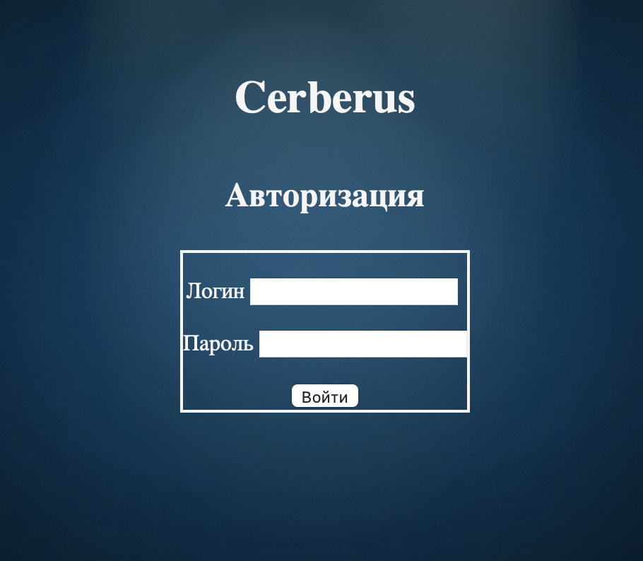

# Cerberus
### Описание
Данная программа круглосуточно, в автоматическом режиме собирает информацию обо всех совершенных продажах как по билетным кассами, так и в кассах кинобара. Систематизируя эту информацию, программа позволяет в любой момент выдать видеоматериал по нужному чеку, в интересующий  отрезок времени.

[Руководство пользователя](user_manual.md)

### Системные требования
* Операционная система Debian 11, Ubuntu 22.04 или выше
* nginx

### Зависимости Cerberus
* mongoDB
* ZoneMinder

Cerberus поддерживает несколько серверов ZoneMinder 

### Установка и настройка Cerberus
1. Установить mongoDB (см. [Установка и настройка mongoDB](install_mongo.md))
2. Установить ZoneMinder (см. [Установка и настройка ZoneMinder](https://zoneminder.readthedocs.io/en/latest/index.html))
3. Установить Cerberus (см. [Установка и настройка Cerberus](install_cerberus.md))

После установки и настройки перейти в веб-браузере по cсылке 
http://my_ip_or_domain

Откроется страница авторизации

### Логин и пароль по умолчанию

Администратор
* логин: *admin*
* пароль: *password*

Пользователь 
* логин: *user*
* пароль: *user*

