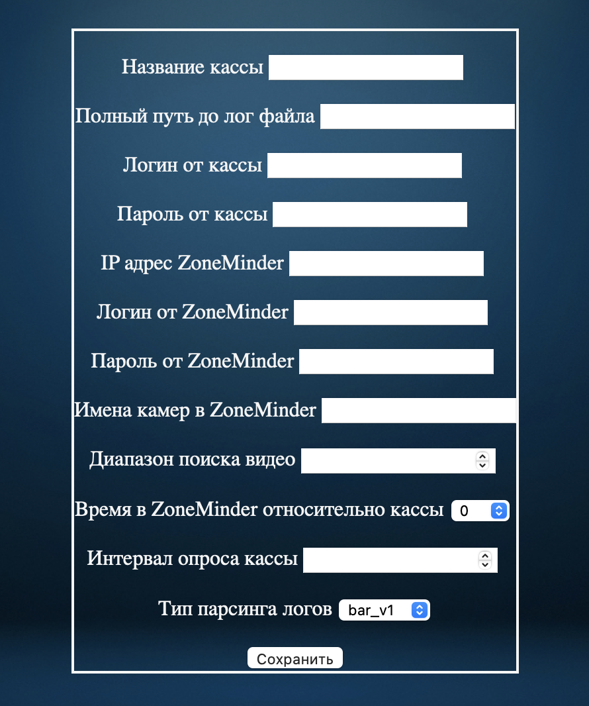
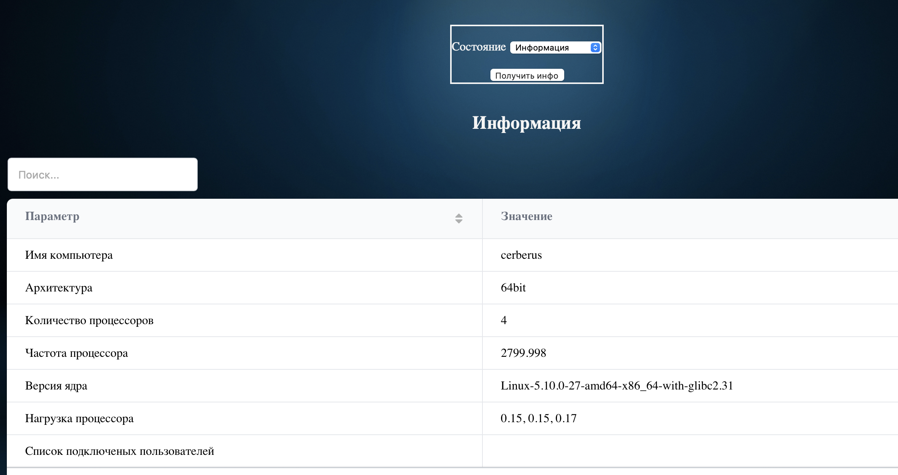

# Cerberus

[назад к описанию](readme.md)

### Меню "Выгрузка статистики"
* Указать кассу и период за который нужно выгрузить чеки

* После выгрузки отобразится таблица с чеками, которые были пробиты за данный период. Таблица динамическая, можно сортировать по столбцам, использовать поиск и т.д. Для просмотра видео по конкретному чеку, необходимо кликнуть по номеру чека в таблице.

* После нажатия на номер чека, в новой вкладке откроется страница, на которой будет отображен чек и все найденое видео зацикленное по кругу.

### Меню "Добавить кассу"

* Название кассы - произвольное название
* Полный путь до лог файла - указать путь до лог файла кассы. Пример: *\\\192.168.0.1\UCS\Premiera_4.0_Client\Logs\fps_uni_fpCustomQ3X54.dll.01.log*, *\\\192.168.0.1\ucs\RKeeper7Cash\default\Rk7Cash\fpRU_AtolDTO_0.log*
* Логин от кассы - логин пользователя samba-шары на кассе
* Пароль от кассы - пароль пользователя
* IP адрес ZoneMinder - указать IP адрес сервера на котором развернут ZoneMinder. Пример: *192.168.0.1*
* Логин от ZoneMinder - указать логин пользователя ZoneMinder, который имеет права на просмотр событий и доступ по API
* Пароль от ZoneMinder - пароль пользователя ZoneMinder
* Имя камеры ZoneMinder - указать имя камеры в ZoneMinder
* Время в ZoneMinder относительно кассы - указать разницу во времени между ZoneMinder и кассой (необходимо, если касса и ZoneMinder находятся в разных часовых поясах)
* Тип парсинга логов - указать тип парсинга логов. (о типах парсинга см. [типы парсинга](readme.md))

### Меню "Управление кассой"

Данный раздел позволяет
* Остановить сбор логов - останавливает сборщик логов для выбранной кассы (необходимо, если нужно отредактировать кассу)
* Запустить сбор логов - запускает сборщик логов для выбранной кассы
* Редактировать кассу - позволяет полностью отредактировать настройки кассы и переименовать. (см. "Добавить кассу")
* Удалить кассу - удаляет кассу из БД, а так же, удаляет всю информацию о собранных чеках.

### Меню "Состояние системы"

Показывает информацию по всем сборщикам логов (состояние, ошибки)

### Меню "Лицензия"

Показывает информацию о сроках действия лицензии. Так же позволяет активировать лицензию.
Для активации лицензии, неодходимо
* нажать на ссылку *"Создать ключ для получения лицензии"*
* в новом окне сгенерится новый ключ, его необходимо отправить на почту [admin@5ru.ru](mailto:admin@5ru.ru) для получения сертификата лицензии
* полученный сертификат ввести в поле *"Сертификат лицензии"* и нажать сохранить

### Меню "Настройка / Пользователи"

Данный раздел позволяет добавлять и удалять пользователей в системе
* редактировать - редактирует существующего пользователя в системе
* удалить - удаляет пользователя из системы
Для добавления нового пользователя необходимо кликнуть *"Добавить пользователя"* и заполнить форму

* Администратор - права администратора (полный доступ ко всем настройкам)
* Пользователь - права пользователя (позволяет только выгружать статистику и просматривать видео)

### Меню "Настройка / Состояние сервера"

Позволяет просматривать состояние сервера
* нагрузка на процессор
* состояние памяти
* состояние дисков
* настройка сети
* состояние сети
* список запущенных процессов

[назад к описанию](readme.md)

